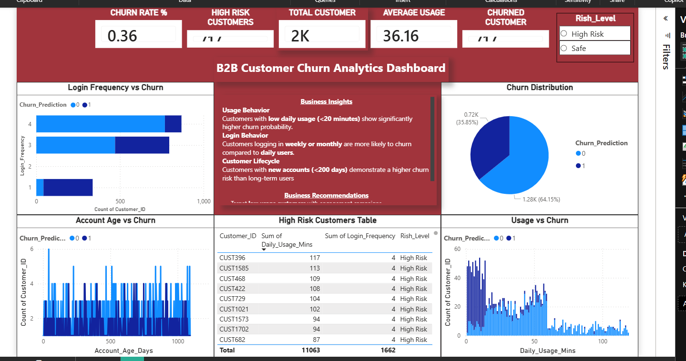

###### **B2B Customer Churn Prediction \& Analysis**

###### 

###### **Problem Statement**


Customer churn is a major challenge for businesses, as losing customers directly impacts revenue and growth.

This project aims to "identify high-risk customers" and analyze the key factors driving churn to improve retention strategies.


###### **Dataset**


The dataset includes customer behavioral and usage data such as:


\* Login Frequency

\* Daily Usage (minutes)

\* Account Age (days)

\* Customer activity patterns

\* Target variable: Churn (Yes/No)


###### **Tools \& Technologies**


\* Python (Pandas, NumPy)

\* Data Visualization (Seaborn, Matplotlib)

\* Machine Learning (Scikit-learn – Random Forest)

\* Dashboarding (Power BI)


###### **Project Workflow**


**1. Data Cleaning**


&#x20;  \* Handled missing values

&#x20;  \* Removed duplicates

&#x20;  \* Standardized dataset


**2. Feature Engineering**


&#x20;  \* Converted login frequency into numerical format

&#x20;  \* Created usage-based features

&#x20;  \* Generated churn risk levels


**3. Model Building**


&#x20;  \* Trained Random Forest model

&#x20;  \* Predicted churn probability

&#x20;  \* Evaluated using accuracy, precision, recall


**4. Dashboard Development**


&#x20;  \* Built interactive dashboard for churn insights

&#x20;  \* Visualized key risk factors and customer segments


###### **Key Insights (From Dashboard)**


**1.Overall Churn Performance**


\* Churn rate is 36%, indicating a significant retention issue

\* Majority of customers are still active 64%, but risk segment is notable


**2.High-Risk Customers**


\* Identified high-risk customers using ML prediction

\* Risk segmentation helps prioritize retention strategies


**3.Usage Behavior**


\* Low daily usage (<20 minutes) strongly correlates with churn

\* Active users are significantly less likely to churn


**4.Login Behavior**


\* Customers logging in weekly or monthly are more likely to churn

\* Daily active users show higher retention


**5.Customer Lifecycle**


\* New customers (<200 days) have higher churn probability

\* Long-term customers are more stable


**6.Engagement Patterns**


\* Higher engagement → lower churn

\* Lower interaction → higher churn risk


###### **Business Impact**


\* Enables early identification of churn-risk customers

\* Helps companies take proactive retention actions

\* Improves customer lifetime value (CLV)

\* Reduces revenue loss through targeted engagement strategies

## 📸 Dashboard Preview



---

## 🎥 Demo Video

[Watch Demo](churn_analysis.mp4)


###### **How to Run**


```bash id="run890"

pip install -r requirements.txt

python main.py

```

###### **Future Improvements**


\* Deploy model as real-time churn prediction API

\* Integrate customer segmentation (clustering)

\* Add automated retention recommendations

\* Build interactive web app for business users


###### **Author**

Thiviyesh K

Aspiring Data Analyst 


